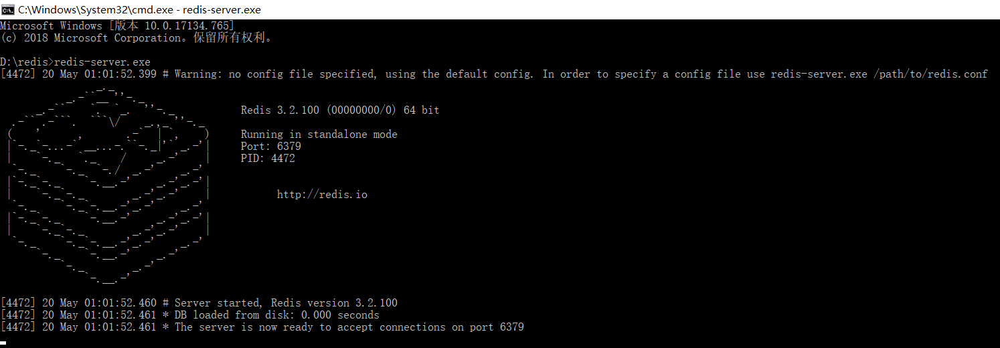

# Happy-spare-money-back-end

## 运行说明

1. 安装cnpm

    ```bash
    $ npm install -g cnpm --registry=https://registry.npm.taobao.org
    ```

2. 在根目录执行

    ```bash
    cnpm install
    ```

    如果遇到问题，可以把根目录下的node_modules文件夹删除，重新`cnpm install`

3. session的存储
    session的存储使用了Redis,需开启Redis服务            
    `Redis中文官方教程：`https://www.redis.net.cn/tutorial/3501.html               
    + Windows操作系统下安装：         
        - 下载地址：https://github.com/microsoftarchive/redis/releases
        - 下载到的Redis支持32bit和64bit。根据自己实际情况选择，将64bit的内容cp到自定义盘符安装目录取名redis。 如 C:\reids
        - 打开一个cmd窗口 使用cd命令切换目录到 C:\redis 运行 redis-server.exe redis.conf 。
        - 如果想方便的话，可以把redis的路径加到系统的环境变量里，这样就省得再输路径了，后面的那个redis.conf可以省略，如果省略，会启用默认的。输入之后，会显示如下界面：        
        
        - 为保证服务器在后台工作请不要关闭命令行
    + Linux 下安装
        下载地址：http://www.redis.net.cn/download/，下载最新文档版本。                
        本教程使用的最新文档版本为 2.8.17，下载并安装：
        ```
        $ wget http://download.redis.io/releases/redis-2.8.17.tar.gz
        $ tar xzf redis-2.8.17.tar.gz
        $ cd redis-2.8.17   
        $ make
        ```
        make完后 redis-2.8.17目录下会出现编译后的redis服务 
        程序redis-server,还有用于测试的客户端程序redis-cli
        下面启动redis服务.
        ```
        $ ./redis-server
        ```
        注意这种方式启动redis 使用的是默认配置。也可以通过启动参数告诉redis使用指定配置文件使用下面命令启动。
        ```
        $ ./redis-server redis.conf
        ```
        redis.conf是一个默认的配置文件。我们可以根据需要使用自己的配置文件。

        启动redis服务进程后，就可以使用测试客户端程序redis-cli和redis服务交互了。 比如：
        ```
        $ ./redis-cli
        redis> set foo bar
        OK
        redis> get foo
        "bar"
        ```
    + Ubuntu 下安装              
        在 Ubuntu 系统安装 Redi 可以使用以下命令:
        ```
        $sudo apt-get update
        $sudo apt-get install redis-server
        ```
        启动 Redis
        ```
        $redis-server
        ```
        查看 redis 是否启动？
        ```
        $redis-cli
        ```
        以上命令将打开以下终端：
        ```
        redis 127.0.0.1:6379>
        ```
        127.0.0.1 是本机 IP ，6379 是 redis 服务端口。现在我们输入 PING 命令。
        ```
        redis 127.0.0.1:6379> ping
        PONG
        ```
        以上说明我们已经成功安装了redis。


> 执行测试文件
> 
> ```
> node bin/www
> ```
> 
> 正常的话会有输出

## 目录结构

```bash

├─bin               // 自动生成的程序执行入口，里边只有一个www文件  
├─config            // 配置文件，现在只有数据库的配置
├─controller        // 控制器文件夹
├─docs              // 文档
├─node_modules      // 被gitignore了，使用时安装的包
├─public            // 公共资源，使用vue的话，还不不知道怎么使用这里的资源
│  ├─images         
│  ├─javascripts    
│  └─stylesheets    
├─routes            // 路由，负责解析url后的分发任务
└─views             // html模板文件，使用vue可能不需要

```

## Notes
